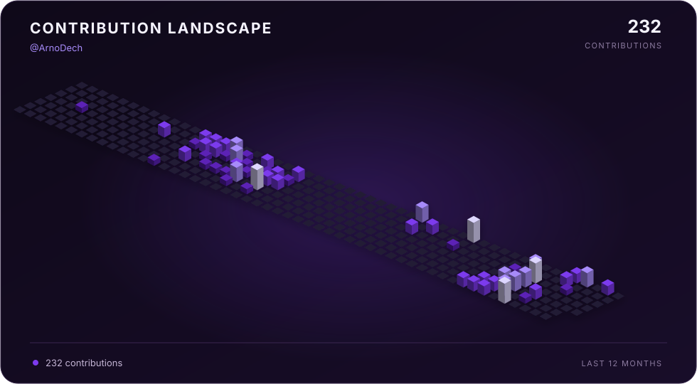

```python
class AboutMe:
    def __init__(self):
        self.username = "ArnoDech"
        self.role = "Data & AI Engineer"
        self.contact = "arnauddeschamp9@gmail.com"
        self.skills = {
            "Data Engineering": ["Airflow", "Kafka", "Spark", "Flink", "dbt", "Databricks", "Snowflake"],
            "Analytics": ["Power BI", "Tableau", "Qlik Sense", "Spotfire"],
            "Cloud": ["Azure", "AWS"],
            "AI & Data Science": ["Python", "pandas", "scikit-learn", "TensorFlow", "LangChain", "LLMs"],
            "Backend": ["FastAPI", "Flask", "Django"],
        }
        self.certifications = ["Azure", "Databricks", "Snowflake", "Talend"]

profile = AboutMe()
```

<h2 align="center">Contribution Landscape</h2>

<p align="center">
  
</p>
